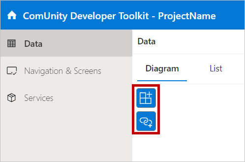

# Creating Entities in the Data Model: Step-by-Step Guide

In the ComUnity Developer Toolkit, you have the flexibility to create entities within your data model in two ways: starting from scratch ( custom entities)  or utilising existing SQL tables. This provides you with the freedom to tailor your data model according to your specific requirements. In this section, we will explore both options, guiding you through the process of creating entities from scratch and mapping them from SQL tables.&#x20;

## Create a Custom Entity

To create a custom entity, follow these steps:

1. In your project settings in the Toolkit navigate to Data then select Diagram or List to view your Data Model.
2.  Locate the .png>) icon on the Diagram or List  (shown below) view. This icon allows you to add a new entity to your data model.\
     (1).png>)

    \
    
3. Click .png>) icon, and an **Add a new entity** modal window will appear on your screen.\
   .png>)
4. In the **Entity Name** box, provide a descriptive name for your entity. Choose a name that represents the object or concept it represents in your application. Note that a valid entity name  is unique and cannot contain special characters or spaces.
5. Finally, click on the **Add an entity** button to create your custom entity.

Integrate your existing data seamlessly into your data model using the ComUnity Developer Toolkit. By automatically generating entity fields from your existing tables, you save time and effort. Simply migrate your database to the ComUnity platform with the assistance of the ComUnity Team, and during entity creation, these existing tables will be readily available in your Data model. Simplify the process and ensure data consistency by leveraging this automation feature.

To create an entity from existing SQL Tables, follow these steps:

1. Follow the steps outlined in [Create a Custom Entity](creating-entities-in-the-data-model-step-by-step-guide.md#create-custom-entities) to access the **Add a new entity modal** window.
2. In the modal window, under **Create from existing SQL Tables**, you will find a greyed-out select field.\
   .png>)\

3. Click on **Create from existing SQL Table** to activate the select field.
4. Choose an option from the select field that corresponds to the existing SQL table you want to create an entity from.
5. In the **Entity Name** box, provide a descriptive name for your entity. Choose a name that represents the object or concept it represents in your application. Note that a valid entity name  is unique and cannot contain special characters or spaces.
6. Finally, click **Add an Entity** to create the entity based on the selected SQL table.

By following these steps, you can effortlessly incorporate your existing SQL tables into your data model, leveraging the power of the ComUnity Developer Toolkit.

### Entity Properties

To view the entity properties in a Diagram view, simply click on the entity's header section with a grey background colour. An active entity can be identified by its blue border, and none of its entity fields will be active (active entity fields have a blue background colour). This action will open a properties dialog that displays the global properties specific to the entity.

Conversely, if you are in a List view, clicking on an entity will activate it, and an active entity will have a distinctive blue background colour. Clicking on the entity in this view will also open the properties dialog, allowing you to explore and modify the entity's global settings.

For a detailed description and explanation of each entity property, please refer to the table below.

<table><thead><tr><th width="297.3333333333333">Property Name</th><th>Description</th></tr></thead><tbody><tr><td>Inherits from Entity</td><td>View <a href="broken-reference">Managing Inheritance in the Data Model: Configuring Entity Hierarchy and Inheritance</a></td></tr><tr><td>Entity Set Name</td><td>The name of the EntitySet in <a href="broken-reference">OData</a> URLs. By default the Entity Set and SQL table name are the same.</td></tr><tr><td>Edit Table Security</td><td>View <a href="broken-reference">Setting Up Role-Bases Permissions for Entities: Access Control Configuration</a></td></tr><tr><td>Custom Property Definitions</td><td><mark style="color:orange;"><strong>Unsupported in V4</strong></mark></td></tr><tr><td>Table Name</td><td>SQL table name</td></tr><tr><td>Temporal (History) Table</td><td>Choose whether to add or remove support for storing change history</td></tr><tr><td>Reset Custom Code</td><td>Check to replace custom code with default template</td></tr><tr><td>Custom Code</td><td>Logic that executes when intercepting change operations</td></tr><tr><td>List Title Template</td><td>Default template used for rendering titles of lists containing items of the entity set</td></tr><tr><td>List Detail Template</td><td>Default template used for rendering detail line of lists containing items of the entity set.</td></tr><tr><td>Sort Order</td><td>Default sort order when fetching entity set</td></tr><tr><td>Data Service Url</td><td>Override the default <a href="broken-reference">OData</a> URL for the EntitySet endpoint with a custom Web API URL handling reading, inserting, updating and deleting records.</td></tr><tr><td>Max Age</td><td>The valid life time for data used in automatically refreshing lists.</td></tr></tbody></table>
